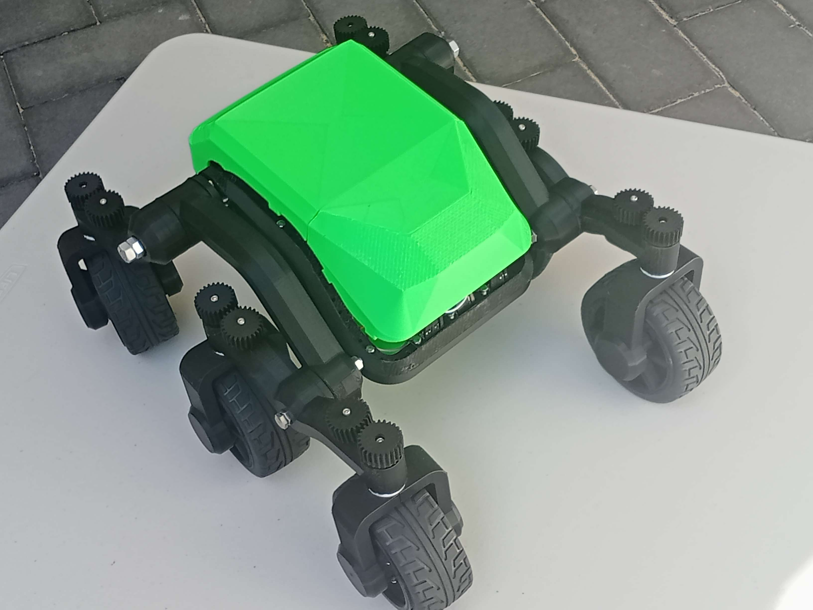

## Overview

A 6-wheel rocker-bogie rover featuring custom electronics and embedded control systems, built on the **Wild Willy** mechanical design originally created for the [DTU RoboCup](https://robocup.dtu.dk/) stair-climbing challenge.

This project focuses on developing advanced motor control algorithms, power management systems, and autonomous navigation capabilities using modern embedded systems and robotics frameworks.

The rocker-bogie suspension design, inspired by NASA's JPL Martian rovers, enables:
- Independent control of all six wheels
- In-wheel motor mounting for improved weight distribution
- Integrated cable management throughout the arm structure

### Project Scope & Attribution

**Original Mechanical Design**: [Wild Willy](https://robocup.dtu.dk/) - 3D printable rocker-bogie chassis, differential systems, and frame structure. The STL files are included in this repository for assembly reference.

**Custom Development Work**:
- **Electronics Design**: Motor driver circuits, power distribution, sensor integration
- **Embedded Software**: Arduino-based PID motor control, encoder feedback systems
- **Control Algorithms**: Speed regulation, differential steering implementation  
- **Future Development**: ROS2 integration for autonomous navigation and SLAM

The differential mechanism between the main arms is housed internally to maximize available mounting space. The frame features mounting points around the perimeter for expansion with additional sensors and systems.

> **Project Status**: Active development. Current implementation includes basic drive systems and manual control. Ongoing work focuses on closed-loop PID motor control and preliminary autonomous navigation capabilities.

## 3D Printing

Look at the file names to determine how many times you need to print each item (e.g 1x_1xm means print one time as-is and one time mirrored).

The largest part is the frame. If it is too large for your printer, consider placing it on the side and diagonally on the bed. An alternative is to split the mesh in two and this way it can also be printed without supports.

All of the parts were printed with the same settings, the only variable being the supports, which for some models are not required:

- Layer height 0.2mm
- Infill: 10%
- Material: PLA
- Printing temperature: Nozzle: 205, Plate: 60, Flow: 100%
- Speed: 80mm/s
- Supports: yes
- Build plate adhesion: Raft 

**Printing parts**

| Qty | Part | Supports | Est. time (per unit) | Total time | Preview | Qty | Part | Supports | Est. time (per unit) | Total time | Preview |
| --- | --- | --- | --- | --- | --- | --- | --- | --- | --- | --- | --- |
| 1x_1xm | pusher | everywhere | 35mins | 1h10m |  | 1x_1xm | small bevel gear | everywhere | 56mins | 1h52m |  |
| 1x_1xm | top arm back | touching buildplate | 4h40m | ~9h |  | 1x_1xm | Top arm coupler | everywhere | 1h2m | 2h4m |  |
| 1x_1xm | top arm front | touching buildplate | 5h48m | ~12h |  | 1x | bottom | everywhere | 10h17mins | 10h17m |  |
| 1x | differential mount | everywhere | 1h28m | 1h28m |  | 1x | large bevel gear | everywhere | 1h24m | 1h24m |  |
| 1x | top back | everywhere | 8h47m | 8h47m |  | 1x | top front | everywhere | 7h | 7h |  |
| 2x | arm lower | touching buildplate | 5h20m | ~11h |  | 2x | end stop | everywhere | 44mins | ~1h30m |  |
| 6x | gear | everywhere | 29mins | 1h |  | 6x | gear servo | everywhere | 24mins | 2h27m |  |
| 6x | motor arm 1 | touching buildplate | 2h44m | 16h2m |  | 6x | motor arm 2 | touching buildplate | 1h43m | 10h2m |  |
| 6x | motor mount couplers | everywhere | 45m | 4h29m |  | 6x | rim | everywhere | 6h34m | ~40h |  |
| 12x | motor mount | everywhere | 25mins | 2h30m |  | 1x | frame pt1 | everywhere | 7h32m | 7h32m |  |
| 1x | frame pt2 | everywhere | 5h48m | 6h9m |  |  |  |  |  |   |  |
|  |  |  |  |  |  |  |  |  |  | Total | ~181h |

## Bill of materials

| Qty | Part | Buy | Price | Total Price |
| --- | --- | --- | --- | --- |
| 6x | 25GA370 DC 6V Micro Gear Motor, 130 RPM, 1:46:8 | [Buy](https://www.aliexpress.com/item/1005006213989239.html) | $10.19 | $68.14 |
| 6x | Servos: TGY-R5180MG | [Buy](https://www.aliexpress.com/item/1005001817755047.html) | $7.34 | $53 |
| 6x | Tires: BS701-002T (103mm )D, 72mm ID, 42mm width | [Buy](https://www.aliexpress.com/item/33042672599.html) | Price | Total Price |
| 1x | M8 Threaded Rod 285mm | [Buy](https://amzn.to/49huaWb) | Price | Total Price |
| 6x | 4mm Rigid flange coupling | [Buy](https://amzn.to/3PEXTBy) | Price | Total Price |
| 1x | Teensy 4.1 | [Buy](https://core-electronics.com.au/teensy-4-1-headers.html) | Price | Total Price |
| 1x | Raspberry Pi zero W | [Buy](https://amzn.to/3vCqAYT) | Price | Total Price |
| 1x | Rassperry PI W Zero camera | [Buy](https://amzn.to/4cGiFL0) | Price | Total Price |
| 1x | Signal wire | [Buy](https://amzn.to/3VGxy9L) | Price | Total Price |
| 1x | Power Wire | [Buy](https://amzn.to/49dfCXC) | Price | Total Price |
| 1x | Servo extension cables | [Buy](https://amzn.to/4axRzDK) | Price | Total Price |
| 1x | Metal glue | [Buy](https://amzn.to/3vyFaR6) | Price | Total Price |
| 3x | Makerverse motor driver (2 channel) | [Buy](https://core-electronics.com.au/makerverse-motor-driver-2-channel.html) | Price | Total Price |
| 1x | LiPo Battery | [Buy](https://amzn.to/3vCszwn) | Price | Total Price |
| 1x | Smart Charger | [Buy](https://amzn.to/3xpqFzy) | Price | Total Price |
| 1x | XT60 Connector | [Buy](https://amzn.to/3IYikWc) | Price | Total Price |
| 1x | DC Buck Converter | [Buy](https://amzn.to/4ayl34v) | Price | Total Price |
| 1x | M2 & M3 nuts and bolts assorted pack | [Buy]() | Price | Total Price |

Alternatives (replacements)

| Qty | Part | Buy | Price | Total Price |
| --- | --- | --- | --- | --- |
| 6x | Servos: DS041MG | Buy | Price | Total Price |
| 6x | Tires:  | [Buy](https://www.aliexpress.com/item/33042672599.html) | Price | Total Price |
| Qty | Tires: |[ Buy](https://www.aliexpress.com/item/1005003695930838.html) | Price | Total Price |
| 1x | Arduino Mega | [Buy](https://amzn.to/3PLritH) | Price | Total Price |
| 3x | Motor driver controller | [Buy](https://amzn.to/43F0xNb) | Price | Total Price |

## Schematics

- [diagram](./images/circuit_image.svg)
- [cirkit designer diagram](https://app.cirkitdesigner.com/project/dcd96944-0a77-4412-a378-ee0936a374ed)

### Power

- motor 450mA (450 x 6) = 2.7A
- servos 100-250 mA = (250 x 6) = 1.5A

- ~ 4.2A

## Assembly instructions

The robot can be fully assembled with M3 nuts and bolts. The arms are supported by long M8 threaded rod. The top lid attached with magnets. The fully assembled robot is about 430x330x220 mm (LxWxH)

[video here](https://www.youtube.com/watch?v=bXdt8hng2WM)

## Software & Control

### Arduino Sketches

Located in `src/Arduino/sketches/`:

- **Drive test** sketch that implements a basic crab steering mode
- **pid_control**: PID control implementation for JGA25-370 motors with encoder feedback
- Additional sketches for various control modes (in development)
- Tests sketches to verify correct operation of the actuators (servos, motors)

### Getting Started with Code

1. Install [Arduino IDE](https://www.arduino.cc/en/software) or [PlatformIO](https://platformio.org/)
2. Connect your Arduino board
3. Open the desired sketch from `src/Arduino/sketches/`
4. Adjust pin definitions to match your wiring
5. Upload and test

### ROS Integration (Planned)

- Autonomous navigation
- Vision-based obstacle detection
- SLAM capabilities

## Project Status

- ✅ Mechanical design and 3D models
- ✅ Basic drive system
- 🚧 PID motor control (in development)
- 🚧 ROS integration (planned)
- 📋 Autonomous stair climbing (planned)

## Contributing

Contributions are welcome! Please read [CONTRIBUTING.md](CONTRIBUTING.md) for guidelines on how to contribute to this project.

## License

- **Software**: MIT License - see [LICENSE](LICENSE)
- **Hardware**: Creative Commons Attribution-ShareAlike 4.0 International License

## Acknowledgments

- **Wild Willy** - Original rocker-bogie mechanical design and 3D printable chassis
- **DTU RoboCup** - Competition framework that inspired the original design
- **NASA JPL** - Rocker-bogie suspension concept from Martian rover programs

