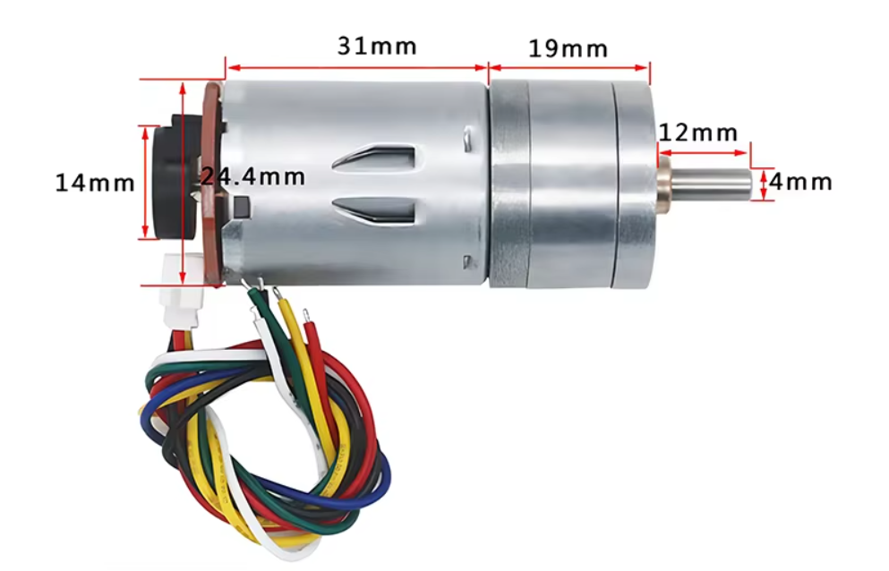
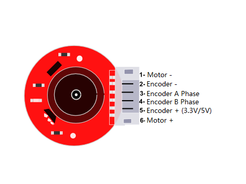
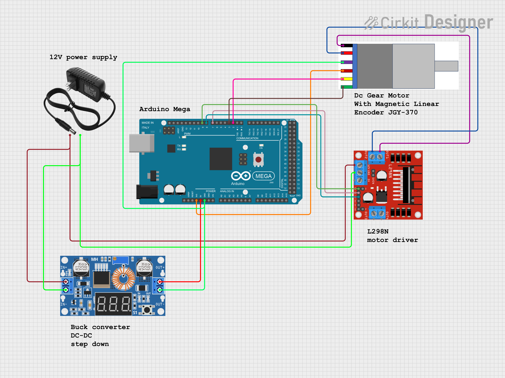

# 25GA370 DC Geared Motor

<!--Write a short description describing the purpose of the SOP package.-->

## Table of Contents

- [dimensions](#dimensions)
- [specification](#specification)
- [interface definition](#interface-definition)
- [pinout](#pinout)
- [hookup guide](#hookup-guide)

## Dimensions



## Specification

<!--Write the specification of the sensor or actuator.
Also include links to the datasheet and manuals.-->

- **Motor Type:** Brushed DC Motor
- **Encoder Type:** Quadrature Encoder
- **Supply Voltage:** Typically 6V to 12V DC
- **Rated Speed:** Varies, e.g., 1000 RPM at 12V
- **Rated Torque:** Varies, e.g., 1 Nm at 12V
- **Gear Ratio:** Often included, e.g., 50:1

## Interface definition

<!--Create a table with the pinout of the sensor or actuator.
Include the pin number, signal name, signal type, and signal description.-->

| Pin | Name | Type | Description |
| --- | --- | --- | --- |
| Motor - (white) | Motor GND | Power | motor ground |
| Encoder - (black) | Encoder GND | Power | encoder ground |
| Enable A (yellow) | Enable Motor A | digital | output pulses for speed/position |
| Enable B (green) | Enable Motor B | digital | output pulses for direction |
| Encoder + (blue) | Encoder 3.3V/5V | Power | encoder Vin |
| Motor + (red) | Motor Vin | Power | motor vc |

## Pinout



## Hookup guide

<!--Describe how to connect the sensor or actuator to the microcontroller or processor.-->



## Installation

<!--Describe how to install the software required to use the sensor or actuator.-->

1. Connect the motor power pins to the your power supply, ensuring the voltage is within the motor's rated specifications.
2. Connect the encoder VCC to a 3.3V or 5V power supply from your microcontroller (e.g. Arduino UNO).
3. Connect the encoder GND to the ground of your microcontroller.

Notes:
- Ensure the power supply does not exceed the motor's voltage rating to prevent damage.
- Use a motor driver or H-bridge to control the motor's direction and speed.
- Implement debounce logic in software or hardware to ensure accurate encoder readings.
- Consider using a pull-up or pull-down resistor on the encoder outputs to stabilize the signal.

## Usage

<!--Include a simple example of how to use the sensor or actuator.-->

To use the motor with an Arduino UNO, you'll need to connect the encoder output pins to two digital input pins on the Arduino. You can use the `attachInterrupt` function to count the pulses from the encoder - these represent the motor's rotation.

```c++
// Define the encoder pins
const int encoderPinA = 2; // Interrupt pin for encoder A
const int encoderPinB = 3; // Interrupt pin for encoder B

volatile long encoderTicks = 0;

// Interrupt service routine for encoder A
void encoderISR() {
  if (digitalRead(encoderPinB) == HIGH) {
    encoderTicks++;
  } else {
    encoderTicks--;
  }
}

void setup() {
  pinMode(encoderPinA, INPUT);
  pinMode(encoderPinB, INPUT);
  // Attach interrupt on a rising edge of encoder A (to call encoderISR)
  attachInterrupt(digitalPinToInterrupt(encoderPinA), encoderISR, RISING);
  Serial.begin(9600);
}

void loop() {
  Serial.println(encoderTicks);
  delay(1000); // Update every second
}
```

## Resources

<!--Include links to the datasheet, manuals, and other resources.-->

- [docs.cirkitdesigner.com](https://docs.cirkitdesigner.com/component/727f690f-5a57-4c09-b784-5f667e6d6b6b/dc-motor-with-encoder)