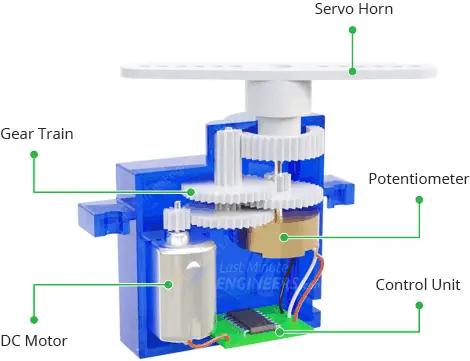

​
# GDW DS031MG Servo

<!-- Short description -->

The GDW DS031MG is a digital metal gear micro servo commonly used in RC helicopters and airplanes. The operating frequency of 1520 microseconds (µs) corresponds to a pulse repetition rate of approximately 333 Hz, which is standard for many servos. This means the servo expects a control signal every 1520 µs



## Table of Contents

- [dimensions](#dimensions)
- [specification](#specification)
- [interface definition](#interface-definition)
- [pinout](#pinout)
- [hookup guide](#hookup-guide)
- [installation](#installation)
- [usage](#usage)
- [resources](#resources)

## Dimensions

- Length: 23mm
- Width: 12.2mm
- Height: 29mm
- Weight: 16g

## Specification
<!-- Also include links to the datasheet and manuals. -->

- **Operating Voltage Range**: 4.8V up to 6.0V
- **Operating Temperature Range**: -20C up to +60C
- **Working Frequency**: 1520us/333Hz
- **Dead Bandwidth**: 3usecs
- **Motor Type**: DC motor
- **Chip Type**: digital
- **Gear material**: copper
- **Horn gear spline**: 25T 4.9mm
- **Wire length**: 170 +/- 5mm

Bench tests

| Test voltage | 4.8V | 6.0V |
| --- | --- | --- |
| Speed | 0.12sec/60deg | 0.10sec/60deg |
| Torque | 2.5kg.cm | 3kg.cm |

## Interface definition

<!-- Create a table with the pinout of the sensor or actuator.
Include the pin number, signal name, signal type, and signal description -->

| Pin | Signal | Type | Description | 
| --- | --- | --- | --- |
| Black | GND | Power | pwm ground signal |
| Yellow | PWM | analog | pwm signal pin |
| Red | 6v | power | 6 pwm power signal |

## Pinout


Standard 3-pin servo connector:
- Brown/Black: Ground
- Red: Power (4.8-6V)
- Yellow/Orange: Signal (PWM)

## Hookup guide

1. Connect the brown/black wire to GND on your microcontroller
2. Connect the red wire to 5V power supply
3. Connect the yellow/orange wire to a PWM capable pin on your microcontroller
4. Ensure power supply can provide enough current (>500mA recommended)

## Installation

No special libraries required for basic Arduino control. For advanced control, you can use:
1. Install Arduino IDE
2. (Optional) Install Servo library:
   - Already included with Arduino IDE
   - Or go to Sketch -> Include Library -> Servo

Given the specs, here's the more specific **PWM signal range** you'll need to control this servo:

- **Pulse width for 0°**: Around **1000 µs** (may vary slightly, but this is typical for most servos).
- **Pulse width for 90°**: Around **1520 µs** (this should be the center position based on your spec).
- **Pulse width for 180°**: Around **2000 µs**.

### Adjusting PWM Frequency:
Since the working frequency is **333 Hz**, this translates to a **3 ms period** (3000 µs per cycle). If you're using the standard **Arduino Servo library**, it typically operates at **50 Hz**, which results in a 20 ms period (20000 µs). Since this servo is designed for **333 Hz**, you may need to use a different library or adjust the PWM frequency.

Here’s an example of how you can adjust the PWM frequency and control the servo using the **Teensy** platform:

## Usage

```c++
#include <PWMServo.h>

const int servoPin = 9;  // Pin where the servo is connected

void setup() {
  pinMode(servoPin, OUTPUT);
  
  // Initialize PWM on the specified pin with a frequency of 333 Hz
  pwm_begin();
  pwm_set_frequency(servoPin, 333);  // Set PWM frequency to 333 Hz
  
  // Position the servo at 90 degrees (center position, 1520 µs pulse)
  pwm_write(servoPin, 1520);  // 1520 µs pulse for center (90 degrees)
}

void loop() {
  // Move the servo to 0 degrees (1000 µs)
  pwm_write(servoPin, 1000);  // 1000 µs pulse for 0 degrees
  delay(1000);  // Wait for 1 second

  // Move the servo to 90 degrees (1520 µs)
  pwm_write(servoPin, 1520);  // 1520 µs pulse for 90 degrees
  delay(1000);  // Wait for 1 second

  // Move the servo to 180 degrees (2000 µs)
  pwm_write(servoPin, 2000);  // 2000 µs pulse for 180 degrees
  delay(1000);  // Wait for 1 second
}
```

## Resources
- [Servo Library Reference](https://www.arduino.cc/reference/en/libraries/servo/)
- [PWM Control Tutorial](https://learn.sparkfun.com/tutorials/pulse-width-modulation)
- [Servo Motor Basics](https://learn.adafruit.com/adafruit-arduino-lesson-14-servo-motors)